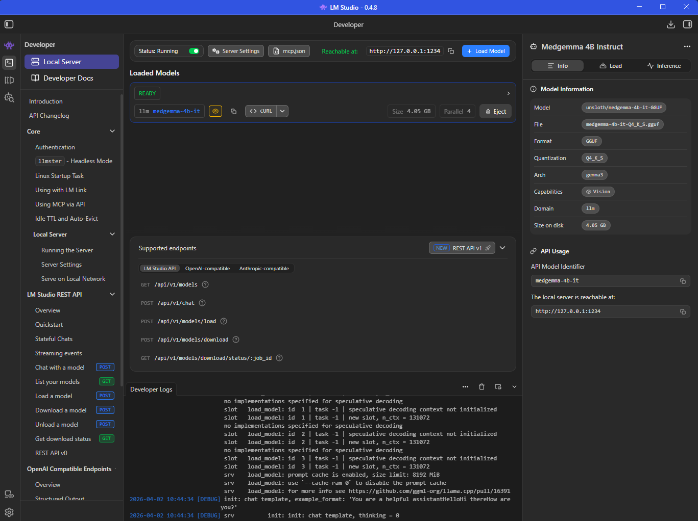
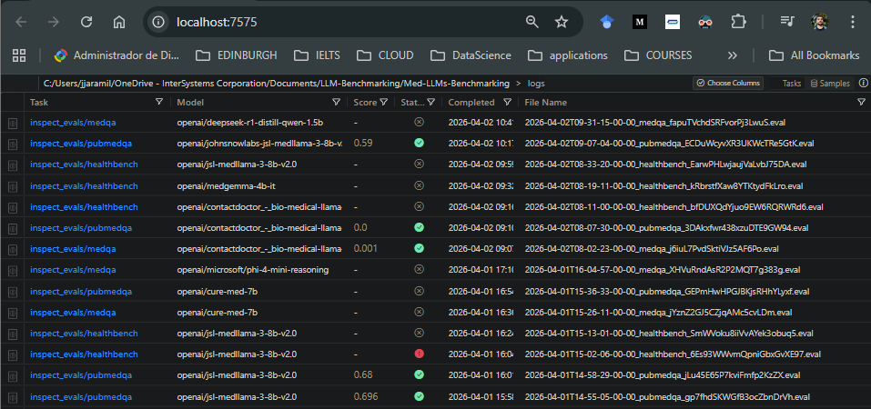

# How to Locally banchmark Open Source LLMs?

If you are considering hosting a LLM locally on your PC, you might want to choose the best model for your specific needs. In this quick tutorial we'll see how to do this without any subscription anywhere.

Demo: https://youtu.be/5ef34XLSfnw

### Requirements:

- LM Studio [link](https://lmstudio.ai/download)
- python 3.12 (install [requirements.txt](requirements.txt))

### Setting up the local server:

1. In LM Studio enable developer mode:

    Settings > Developer > Turn ON

2. In LM Studio find and download models:

    Model Search > find desired model > Download

3. Set up localhost server:

    Developer > Start Server > Load Model > Choose the model you downloaded in step 2

This server will be accessible thorugh port 1234, and has OpenAI, and Anthropic compatible endpoints, in addition with the native LMStudio ones.

After following these steps you should see something like this:

Note: in LM Studio you might want to set the context length to be the max allowed per model, otherwise benchmarks that involve open questions will fail to be answered (HealthBench)

    Settings > Model Defaults > Default Context Length > set to "Model Maximum"

### Choosing a benchmark

Look at all the benchmarks supported by [UKGovernmentBEIS' inspect_evals](https://github.com/UKGovernmentBEIS/inspect_evals), and choose the most relevant for your case, and follow the installation requirements accordingly.

In this case we are interested in healthcare applications, so we are choosing [MedQA](https://github.com/UKGovernmentBEIS/inspect_evals/tree/main/src/inspect_evals/medqa), [PubMedQA](https://github.com/UKGovernmentBEIS/inspect_evals/tree/main/src/inspect_evals/pubmedqa), and [HealthBench](https://github.com/UKGovernmentBEIS/inspect_evals/tree/main/src/inspect_evals/healthbench). So [requirements.txt](requirements.txt) and [test.py](test.py) code were written to evaluate the models on these 3 tests, and you might want to modify these for your own interests.

### Running the Tests and Checking the Results

1. in test.py specify the name of the model to test and then hit

    python test.py

    Note: You might want to take a look at the task manager while the tests run.

2. In root of this repo execute the following to see logs in a UI on http://localhost:7575/

    inspect view

3. go to http://localhost:7575/ and see results:

    